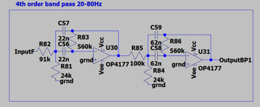
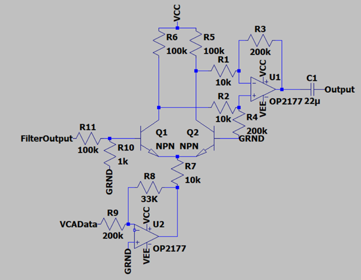

# Analog-EQ
***DOEL***

Dit project is voor een 2de jaars schoolproject van ThomasMore campus De Nayer.

Het doel van mijn project is dat ik een simpele equalizer maak op basis van analoge electronica. Dit doe ik aan de hand van een aantal opamps en 4de orde actieve filters en een VCA per band.

***werking***
zoals eerder gezecht werkt dit project aan de hand van filters. Kort uitgelegt splits ik aan de hand van deze filters het audiospectrum in 5 delen. Deze 5 delen kunnen ieder bediend worden met een VCA. Deze VCA wordt aangestuurd via een digitale potentiometer. Deze potentiometer wordt aangestuurd via een extern STM32 dev bord.

***Filter***

***VCA***

***Projectfotos***

***Projectvideos***
deze video is zeer stil.

<video src='Imagesandvideos/Projectvideo.mov' width=180/>
